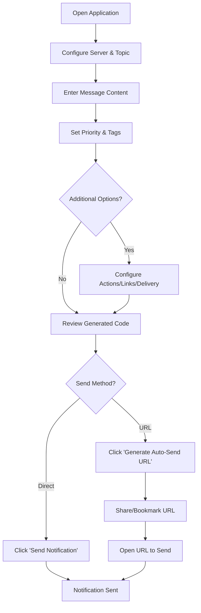
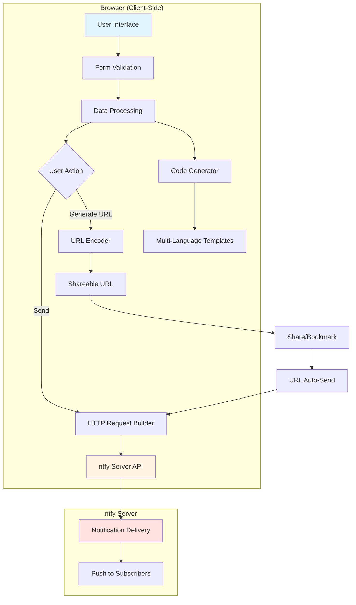

# 📡 xsukax ntfy Sender

A professional, privacy-focused web application for sending notifications through ntfy.sh with real-time code generation across multiple programming languages. This tool provides a comprehensive interface for crafting, testing, and deploying ntfy notifications while maintaining complete client-side privacy and security.

[](https://xsukax.github.io/xsukax-ntfy-Sender)
[](LICENSE)
[](https://ntfy.sh)

## 🔒 Security and Privacy Benefits

**xsukax ntfy Sender** is designed with security and privacy as foundational principles:

- **100% Client-Side Processing**: All form data processing, code generation, and URL encoding operations occur entirely in your browser. No data is transmitted to third-party servers beyond the ntfy notification itself.

- **No Data Collection**: The application does not collect, store, or transmit any user data. There are no analytics, tracking scripts, or telemetry of any kind.

- **Transparent Operations**: Being a single HTML file with embedded JavaScript and CSS, the entire codebase is fully auditable. Users can inspect every line of code to verify security claims.

- **Self-Hosting Ready**: Deploy the application on your own infrastructure to maintain complete control over your notification workflow. The single-file architecture makes self-hosting trivial.

- **Custom Server Support**: While defaulting to ntfy.sh, the application fully supports custom self-hosted ntfy servers, enabling air-gapped or private network deployments.

- **No External Dependencies**: The application requires no external JavaScript libraries, CDN resources, or third-party services (except the ntfy server you choose to use).

- **Secure Auto-Send URLs**: Generated auto-send URLs encode notification data using base64 within the URL fragment, keeping sensitive information client-side and enabling secure sharing.

## ✨ Features and Advantages

### Core Capabilities
- **Comprehensive ntfy Support**: Full implementation of ntfy's feature set including priorities, tags, attachments, actions, delays, email forwarding, and more.
- **Real-Time Code Generation**: Instantly generates equivalent code in 7 programming languages (curl, ntfy CLI, HTTP, JavaScript, Go, Python, PHP) as you configure your notification.
- **Auto-Send URL Generation**: Create shareable URLs that automatically send notifications when opened, perfect for bookmarks, scripts, or webhooks.
- **Professional UI**: Clean, GitHub-inspired interface with responsive design that works seamlessly across desktop and mobile devices.
- **Advanced Options**: Support for Markdown formatting, Firebase toggle, message caching control, and custom notification icons.

### Developer Experience
- **Copy-Paste Ready Code**: All generated code examples are immediately usable with proper escaping and formatting.
- **Interactive Priority Selection**: Visual emoji-based priority selector with clear labels (Min, Low, Default, High, Urgent).
- **Form Validation**: Client-side validation ensures required fields are completed before sending.
- **Error Handling**: Comprehensive error messages for common issues like rate limiting, access denial, and network problems.

### Workflow Integration
- **No Installation Required**: Run directly in any modern web browser without plugins or extensions.
- **Bookmark-Friendly**: Generate auto-send URLs to trigger notifications with a single click from your bookmarks.
- **Developer Toolkit**: Perfect for testing ntfy integrations, debugging notification configurations, or learning the ntfy API.

## 🚀 Installation Instructions

### Option 1: Use the Hosted Demo
Simply visit the live demo at [https://xsukax.github.io/xsukax-ntfy-Sender](https://xsukax.github.io/xsukax-ntfy-Sender) - no installation required.

### Option 2: Clone and Self-Host
```bash
# Clone the repository
git clone https://github.com/xsukax/xsukax-ntfy-Sender.git

# Navigate to the directory
cd xsukax-ntfy-Sender

# Open index.html in your browser
# On macOS:
open index.html

# On Linux:
xdg-open index.html

# On Windows:
start index.html
```

### Option 3: Download Single File
Download `index.html` directly from the repository and open it in any web browser. The application is completely self-contained.

### Web Server Deployment (Optional)
If deploying to a web server:

```bash
# Using Python's built-in server
python3 -m http.server 8000

# Using PHP's built-in server
php -S localhost:8000

# Using Node.js http-server (install with: npm install -g http-server)
http-server -p 8000
```

**Note**: No special server configuration is required. The application is a static HTML file with no backend dependencies.

## 📖 Usage Guide

### Basic Notification Workflow



### Step-by-Step Instructions

#### 1. Configure Server and Topic
- **Server URL**: Enter your ntfy server URL (defaults to `https://ntfy.sh`)
  - For self-hosted servers: `https://your-ntfy-server.com`
  - Click "Reset" to restore default ntfy.sh server
- **Topic**: Enter the topic name to publish to (e.g., `my-alerts`, `server-monitoring`)
  - Topics are created automatically on first use
  - Use unique topics for different notification streams

#### 2. Compose Your Message
- **Message** (Required): Enter the notification body text
  - Supports plain text or Markdown (enable Markdown option below)
  - Multi-line messages are fully supported
- **Title** (Optional): Add a title displayed above the message
  - Helps categorize notifications in the ntfy app

#### 3. Set Priority and Tags
- **Priority**: Select from 5 visual priority levels
  - 🔕 Min (1): Lowest priority, no sound
  - 🔔 Low (2): Subtle notification
  - 🔢 Default (3): Standard notification
  - ⚠️ High (4): Elevated priority with sound
  - 🚨 Urgent (5): Critical alerts with persistent notification
- **Tags**: Add comma-separated tags or emoji shortcuts
  - Examples: `warning`, `computer`, `tada`, `🔥`, `✅`
  - Renders as emojis in ntfy clients when recognized

#### 4. Configure Actions and Links (Optional)
- **Click URL**: URL to open when notification is tapped
- **Icon URL**: Custom icon image for the notification
- **Attachment URL**: Attach files (PDF, images, etc.) to notifications
- **Filename**: Custom filename for attachments
- **Actions (JSON)**: Define action buttons with JSON configuration
  ```json
  [
    {"action": "view", "label": "Open Dashboard", "url": "https://example.com"},
    {"action": "http", "label": "Restart Service", "url": "https://api.example.com/restart"}
  ]
  ```

#### 5. Set Delivery Options (Optional)
- **Delay**: Schedule delivery time (e.g., `30s`, `10m`, `1h`, `tomorrow 10am`)
- **Email Forward**: Forward notification to specified email address
- **Message Cache**: Control server-side caching behavior
- **Markdown**: Enable Markdown formatting for rich text
- **Firebase**: Disable FCM delivery for privacy

#### 6. Send or Generate URL
- **Send Notification**: Immediately send to configured ntfy server
- **Generate Auto-Send URL**: Create shareable URL that sends notification when opened
  - Perfect for bookmarks, scripts, or sharing with team members
  - URL encodes all configuration parameters

### Application Architecture



### Code Generation Features

The application automatically generates equivalent code in 7 languages as you configure your notification:

1. **curl**: Command-line HTTP requests
2. **ntfy CLI**: Official ntfy command-line tool
3. **HTTP**: Raw HTTP request format
4. **JavaScript**: Browser/Node.js fetch API
5. **Go**: Native Go HTTP client
6. **Python**: Python requests library
7. **PHP**: PHP file_get_contents with stream context

Each code example:
- Updates in real-time as you modify the form
- Properly escapes special characters
- Includes only the parameters you've configured
- Can be copied with a single click

### Advanced Use Cases

#### Monitoring Script Integration
```bash
#!/bin/bash
# Server monitoring script
if ! systemctl is-active --quiet nginx; then
    curl -H "Priority: 5" \
         -H "Tags: warning,nginx" \
         -d "NGINX service is down!" \
         https://ntfy.sh/my-server-alerts
fi
```

#### Bookmark-Based Notifications
1. Generate an auto-send URL with pre-filled message
2. Save as browser bookmark
3. Click bookmark to instantly send notification
4. Perfect for quick status updates or check-ins

#### Webhook Endpoint
Use auto-send URLs as webhook endpoints for services that support URL-based webhooks.

## 📄 License

This project is licensed under the GNU General Public License v3.0.

## 🙏 Acknowledgments

- **ntfy**: This application is built to work with the excellent [ntfy](https://ntfy.sh) notification service
- **Community**: Thank you to all users who provide feedback and suggestions

## 🔗 Links

- **Repository**: [https://github.com/xsukax/xsukax-ntfy-Sender](https://github.com/xsukax/xsukax-ntfy-Sender)
- **Live Demo**: [https://xsukax.github.io/xsukax-ntfy-Sender](https://xsukax.github.io/xsukax-ntfy-Sender)
- **ntfy Documentation**: [https://docs.ntfy.sh](https://docs.ntfy.sh)
- **Issue Tracker**: [GitHub Issues](https://github.com/xsukax/xsukax-ntfy-Sender/issues)

## 💡 Tips and Best Practices

- **Rate Limiting**: The public ntfy.sh server has rate limits. For high-volume use, consider self-hosting ntfy.
- **Topic Security**: Use unique, hard-to-guess topic names for private notifications. Consider password-protecting sensitive topics.
- **Testing**: Use the code generation feature to learn the ntfy API and test different notification configurations.
- **Self-Hosting**: For maximum privacy and control, deploy both this application and ntfy on your own infrastructure.
- **Mobile Apps**: Install ntfy mobile apps ([Android](https://play.google.com/store/apps/details?id=io.heckel.ntfy) / [iOS](https://apps.apple.com/us/app/ntfy/id1625396347)) to receive notifications on your devices.

## 🛠️ Technical Details

- **Single File Application**: Entire application contained in `index.html` (HTML + CSS + JavaScript)
- **No Build Process**: No compilation, bundling, or preprocessing required
- **Browser Compatibility**: Works in all modern browsers (Chrome, Firefox, Safari, Edge)
- **Mobile Responsive**: Fully functional on mobile devices with touch-optimized interface
- **Accessibility**: Semantic HTML with proper form labels and ARIA attributes

---

**Created by xsukax** | **Powered by ntfy** | **Open Source & Privacy-First**
